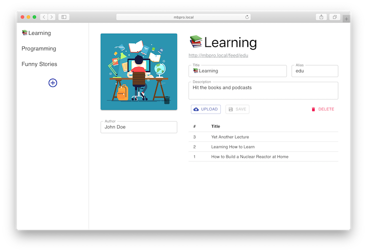

# fakecast

Fakecast is the tool for broadcsting audiofiles as a podcast. It can be used for listening content hasn't been presented on popular podcasting platforms. Also you can maintain a secret podcast to friends of yours.

## Run

`docker run -d -p 80:80 -v $(pwd)/content:/fakecast -e HOST=http://localhost -e CREDENTIAL=user:password azzzak/fakecast`

Then open _HOST_ URL in a browser.

## Settings

| Param      | Type     | Required | Default |
| :--------- | :------- | :------: | :-----: |
| HOST       | _string_ |    ✓     |    -    |
| CREDENTIAL | _string_ |          |    -    |
| PORT       | _int_    |          |   80    |

_HOST_ is root URL of the service. For example, if you use [ngrok](https://ngrok.com) than pass URL you've got from the app (it's like `https://12d34c56b78a.ngrok.io`). Correct _HOST_ is essential to proper work of fakecast.

_CREDENTIAL_ is admin's username and password to access to the service. It can be set in form _user:pass_. If username was omitted you must use _fakecast_ in place of that.